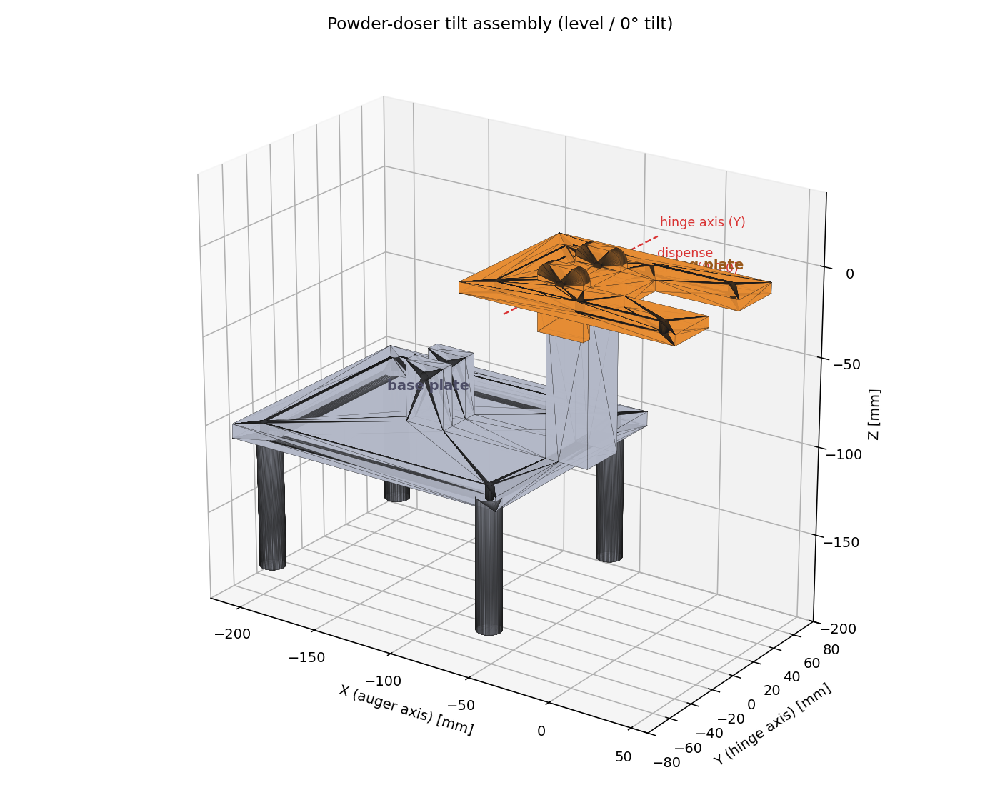
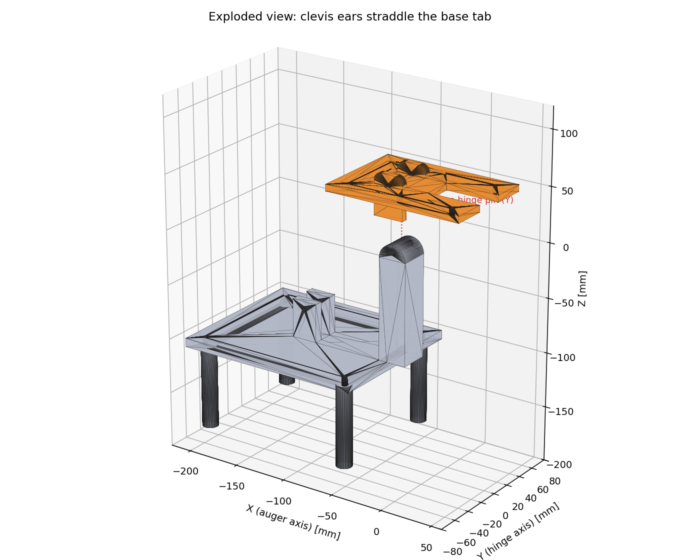
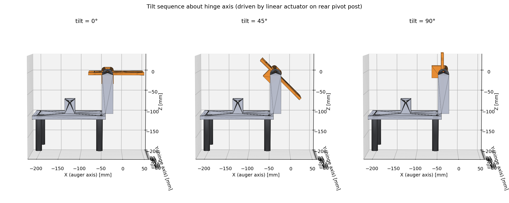
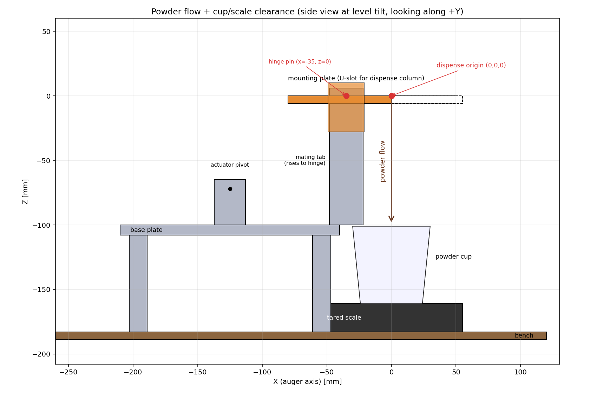

# Powder-doser tilt assembly

Print-ready CAD for a two-part hinged mount that holds a powder doser above
a cup-on-scale and lets it tilt 0°–90° about a horizontal hinge.

This directory was produced while exercising **CADSmith** on a real
multi-component design task (see [CADSmith experience](#cadsmith-experience)
at the bottom for a pros/cons write-up).

## Parts

| Part | STEP | STL | Description |
|---|---|---|---|
| Mounting plate | [`step/mounting_plate.step`](step/mounting_plate.step) | [`stl/mounting_plate.stl`](stl/mounting_plate.stl) | Bolts to the underside of the doser body. A U-slot opens out the +X edge so no plate material crosses the dispense column. Two clevis ears straddle a tab on the base plate. |
| Base plate | [`step/base_plate.step`](step/base_plate.step) | [`stl/base_plate.stl`](stl/base_plate.stl) | Sits on the bench on four legs. A tall mating tab rises to the hinge axis; a rear pivot post gives a linear actuator a clevis point to drive the tilt. |
| Full assembly (level) | [`step/powder_doser_assembly.step`](step/powder_doser_assembly.step) | [`stl/powder_doser_assembly.stl`](stl/powder_doser_assembly.stl) | Both parts mated on the hinge at 0° tilt, for reference / visualisation. Not for printing. |

The source CadQuery script is [`powder_doser_mount.py`](powder_doser_mount.py)
and the diagram generator is [`generate_diagrams.py`](generate_diagrams.py).
Re-run with:

```bash
pip install -r ../../requirements.txt
xvfb-run -a python assets/powder_doser/powder_doser_mount.py
python assets/powder_doser/generate_diagrams.py
```

## Coordinate system

* **Origin (0,0,0)** = dispense point (powder exit, directly above the cup).
* **+X** runs along the auger barrel of the doser.
* **+Y** is the hinge axis (horizontal, perpendicular to the auger).
* **+Z** is up.

The hinge axis is the line `y ∈ ℝ, x = HINGE_X = −35 mm, z = 0`. It is
**offset 35 mm in −X from the dispense point** so the dispense column hangs
out past the front edge of the base plate, leaving the cup-on-scale in clear
air directly under the powder exit. The dispense point itself traces a 35 mm
arc as the doser tilts; that is acceptable because the cup is repositioned
(or the dose is timed) per tilt angle, not held to sub-mm accuracy.

## Diagrams

### 1. Assembly overview (level)


Isometric render at 0° tilt with the hinge axis and dispense origin marked.

### 2. Exploded view


Mounting plate lifted off the base. To assemble, lower the mounting plate
onto the tab so the two ears straddle it, then push an M5 pin through the
ear/tab/ear stack along the Y axis at `z = 0`.

### 3. Tilt sequence (0° → 45° → 90°)


Side views looking along +Y. The mounting plate rotates about the hinge
axis (the red dot in each panel). A linear actuator pinned to the rear
pivot post on the base plate and to a bracket on the mounting plate
provides the drive. With the actuator pin at `(−125, ±10, −72)` and the
hinge at `(−35, 0, 0)` the moment arm is roughly `√(90² + 72²) ≈ 115 mm`
about the hinge, comfortably driven by a 40 N (≈4 kgf) micro linear
actuator.

### 4. Powder flow + cup/scale clearance


Side view showing the powder path: dispense origin → free-fall in clear
air past the front edge of the base plate → cup on a tared scale on the
bench. The base plate footprint stops behind `x = −30 mm`, so neither
plate, tab, post, nor legs sit anywhere above the cup.

## Print orientation

Both parts are designed to be printed flat:

* **Mounting plate** — print with the top face (the one the doser bolts
  onto) facing down, so the clevis ears stick up off the bed and need no
  support. The thin webs where the U-slot meets the back of the plate
  carry the bolt loads in tension along the print plane (good for FDM).

* **Base plate** — print with the top face down, so the tab and the
  actuator post both stick up. The legs need a small tree of support
  underneath each one (or print them as separate cylinders and glue/bolt
  them on if you prefer to keep the main plate supportless).

All clearance holes are M4 (4.4 mm clearance) or M5 (5.2 mm clearance) and
print at FDM tolerance without reaming.

## Bill of materials

* 1 × mounting plate (print, ~71 cm³ of filament)
* 1 × base plate (print, ~322 cm³ of filament)
* 1 × M5 × 50 mm hinge pin + nut
* 1 × M5 × 30 mm actuator pin + nut
* 4 × M4 × 16 mm cap screws to clamp the doser body to the mounting plate
  (uses 4 of the 6 clamp holes; the other 2 give flexibility for different
  doser body footprints)
* 4 × M4 × 20 mm wood screws (or M4 × 20 mm + T-nuts) to bolt the base
  plate down to the bench through the corner holes
* 1 × micro linear actuator (e.g. Actuonix L12-50-50-12-S) — not designed
  here; pin it to the actuator pivot post and to a bracket on the
  mounting plate appropriate to its rod-end geometry.

---

## CADSmith experience

This directory was scoped as a CADSmith stress-test: instead of a single
primitive part (T1/T2 of the benchmark) it requires two cooperating parts
with a shared coordinate frame and a kinematic constraint (the hinge axis
must line up between them). Here is what worked and what did not.

### What worked

* **Parametric authoring is the right call for assemblies.** Defining
  `HINGE_X = −35`, `EAR_Y = 14`, `HINGE_PIN = 5.2` etc. as module-level
  constants and reusing them across `make_mounting_plate()` and
  `make_base_plate()` makes the hinge alignment automatic — change one
  constant and both parts move together. CADSmith generates exactly this
  style of code by default.

* **Programmatic kernel validation catches what eyeball-review misses.**
  Iteration on the hinge-hole geometry was driven entirely by inspecting
  `face.geomType() == "CYLINDER"` and the resulting bounding boxes — the
  same kind of OCCT-kernel introspection CADSmith's Validator uses. The
  first attempt had the hinge holes 20 mm below where the design intent
  required; that would have been invisible in a rendered three-view
  thumbnail, but pops out instantly when you list cylinder face
  centroids.

* **One CadQuery script per directory** keeps the design reproducible and
  diff-friendly. The whole assembly (parts + STEPs + STLs + diagrams)
  rebuilds from `powder_doser_mount.py` + `generate_diagrams.py` with two
  commands.

### What did not work / what would need attention before T3 use

* **Face-workplane drilling is fragile on merged solids.** Doing
  `.faces(">Y").workplane().center(...).hole()` on the result of multiple
  `union()` calls silently no-op'd because the projected-origin / local-axis
  conventions on the merged face were not what they would have been on the
  original ear box. Switching to **explicit Y-axis cylinder cutters** and
  `.cut()` was unambiguous and is the pattern CADSmith should prefer for
  any feature that needs to align to a global axis across multiple bodies.

* **`cq.Location` API churn bit us.** The first draft used
  `cq.Location(...).inverse().inverse()` (defensive cargo-culted from
  online examples) which raised `TypeError: 'Location' object is not
  callable` on cadquery 2.7. Dropping the no-op chain fixed it. For
  CADSmith this means the Coder agent's RAG knowledge base should be
  pinned to a cadquery version and re-validated when that pin moves.

* **Helix/sweep features still need the
  [Compound workaround](../powder_doser_auger.py)** — `union()` of a thin
  sweep into a thick body collapses the swept feature. None of the parts
  in this directory hit that path, but if the next iteration adds a
  swept reinforcement rib it will, and the existing RAG entry on this
  failure mode should be surfaced earlier in the Coder pipeline (right
  now it is only consulted after an error fires).

* **The Vision Judge's three fixed views miss inter-part alignment.** A
  level isometric + a top-down + a front view all look fine even when the
  two hinge-hole sets are vertically misaligned, because both parts sit
  in the right region of the bounding box. For multi-part assemblies the
  Judge needs at least one *exploded* view, or a view explicitly aligned
  to the mating feature. This is the same class of failure the drone
  frame near-miss demonstrates in the README at the repo root.

### Net take

CADSmith's planner/validator/refiner loop is well-shaped for this kind of
design — most of the bugs above are tractable by **tightening the
validator's checks** (assert that named features at specified global
coordinates exist in the kernel output) rather than by replacing any of
the agents. For a T3-style assembly, that promotion of "the named hinge
hole really is at `(HINGE_X, ±EAR_Y, 0)`" from a manual eyeball check to
an automated kernel assertion is the single biggest leverage point.
